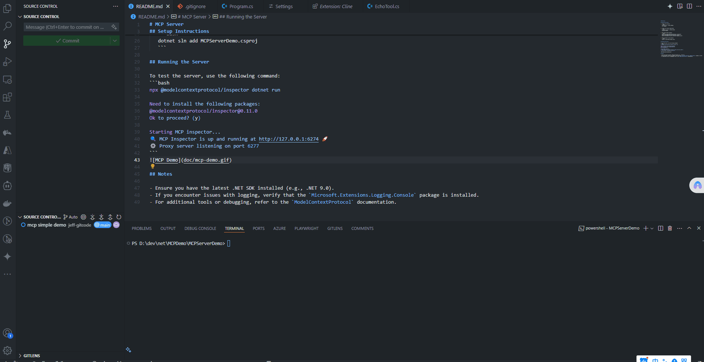

# MCP Server

## Setup Instructions

1. Create a new solution:
   ```bash
   dotnet new sln --output MCPDemo
   cd ./MCPDemo
   ```

2. Create a new console application:
   ```bash
   dotnet new console -n MCPServerDemo
   cd MCPServerDemo
   ```

3. Add required NuGet packages:
   ```bash
   dotnet add package ModelContextProtocol --prerelease
   dotnet add package Microsoft.Extensions.Hosting
   dotnet add package Microsoft.Extensions.Logging.Console
   ```

4. Add the project to the solution:
   ```bash
   dotnet sln add MCPServerDemo.csproj
   ```

## Running the Server

To test the server, use the following command:
```bash
npx @modelcontextprotocol/inspector dotnet run

Need to install the following packages:
@modelcontextprotocol/inspector@0.11.0
Ok to proceed? (y)

Starting MCP inspector...
🔍 MCP Inspector is up and running at http://127.0.0.1:6274 🚀
⚙️ Proxy server listening on port 6277
```


## Notes

- Ensure you have the latest .NET SDK installed (e.g., .NET 9.0).
- If you encounter issues with logging, verify that the `Microsoft.Extensions.Logging.Console` package is installed.
- For additional tools or debugging, refer to the `ModelContextProtocol` documentation.